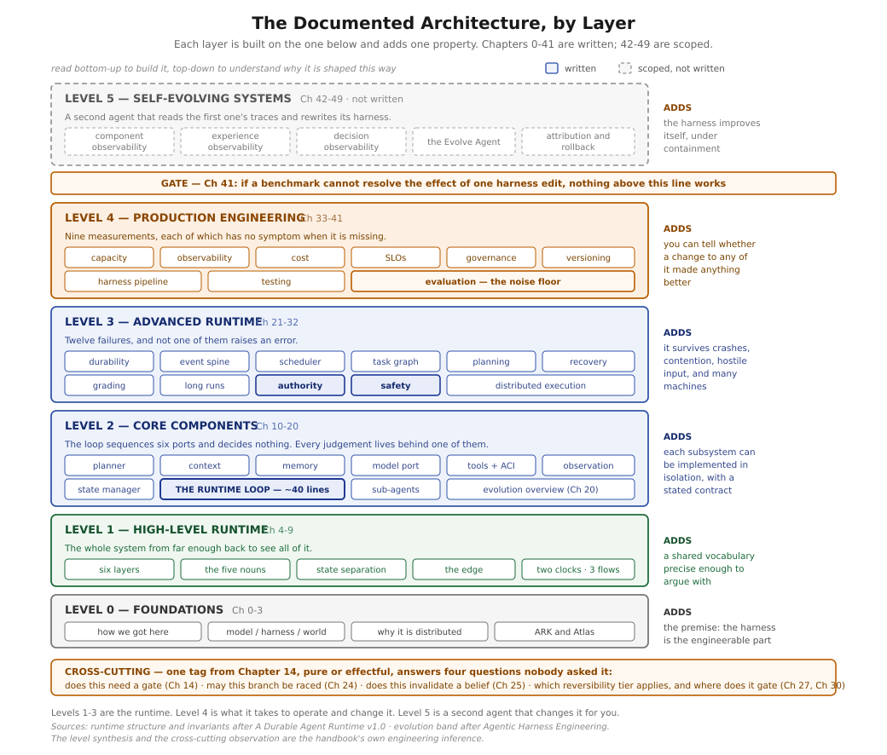

# Agent Harness Runtime

A documentation-first reference for understanding and designing production-grade autonomous agent runtimes and self-evolving agent harnesses.

> **Project status:** architecture and handbook work in progress. This repository contains all 50 handbook chapters, a detailed runtime specification, a compiled handbook draft, source diagrams, and the Agentic Harness Engineering research paper. It is a knowledge base, not an executable runtime implementation.
>
> **The handbook is complete.** Fifty chapters across six levels, both interludes, six level openers, front matter F.1-F.4, all ten appendices, and a v1.0 compiled reading edition. Every `Ch NN §M` reference in the book resolves to a section that exists, checked mechanically.
>
> New readers should start with [F.1 — How to Read This Handbook](docs/handbook/front-matter/f1-how-to-read-this-handbook.md) for the four tracks, or the [Reading Map](docs/handbook/READING-MAP.md) for a plain-language summary of every chapter.

Every chapter is written to be followable by an engineer new to both AI systems and distributed systems: each opens with a plain-language summary and an analogy whose breaking point is stated explicitly, derives its subject from first principles rather than asserting it, and closes with a glossary of the terms it introduced.



## Architecture

The material treats an autonomous agent as considerably more than a model in a loop. What is
documented divides into three bands, each built on the one below.

**The runtime (Levels 1-3, Chapters 4-32).** A thin stateless edge accepts goals, approvals, and
signals. A durable substrate — one transactional database and one queue — holds commands, events,
run state, activities, budgets, and approvals. A generic kernel drives leased, checkpointed work
through a loop of roughly forty lines that sequences six ports and decides nothing itself; every
judgement lives behind one of those ports. A narrow command/event boundary keeps the product domain
independent of all of it.

Level 3 is what that costs in reality: durable execution and replay, a transactional outbox with
claim-based delivery, latency-class scheduling with per-tenant admission, work as a dependency graph
with durable joins, plan repair distinguished from replan, three tiers of effect reversibility,
grading on a lattice where a model judgement may lower a verdict and never raise it, progress
defined as novel durable state, human authority enforced in the runner rather than in the prompt,
capability that cannot read the content it is protecting against, and an honest account of what a
lease does and does not guarantee across machines.

**The operational surfaces (Level 4, Chapters 33-41).** Capacity sized per surface from measured
service times; two observability systems answering two different questions; cost denominated in
successful outcomes rather than calls; service levels promising what the runtime controls and
publishing what it does not; tenancy and deletion across every store that holds customer material;
the harness versioned separately from the model and shipped through a pipeline with two gates; a
test suite in which retrying is forbidden; and — the gate into the final band — an evaluation
harness that knows its own noise floor.

**The evolution loop (Level 5, Chapters 42-49).** A second agent that
reads the first one's traces and rewrites its harness, under containment. Chapter 20 introduces the
frame early so it can be carried through the levels below it, and eight places in Chapters 12-41
independently conclude that some specific thing must sit outside what such a loop may edit.
Chapter 42 makes the case for the loop existing at all: harness fit is a rate rather than a stock,
it decays whenever the base model changes, and the scarce resource it consumes is reading rather
than deciding. Chapter 43 builds the action space it edits, where the load-bearing property is that
two components must never own the same behaviour — because a difference measurement is meaningless
unless exactly one thing changed. Chapter 44 supplies the evidence that aims at it, distilling ten
million tokens of trajectory into ten thousand by keeping every field that could change which
component a failure belongs to and pointing at everything else. Chapter 45 makes each edit a
falsifiable contract, and shows that a loop scored on claims too vague to fail will learn to make
them without any deception at all. Chapter 46 collects all eleven — from Chapters 12 through 43,
each found by an author writing about something else. Chapter 47 decides whether an edit helped,
and adds a fourth verdict for the cases where six edits and one measurement cannot say. Chapter 48 is
the honest accounting: gains that do not stack, a loop that cannot see what it is about to break, and
an aggregate that hid ten points of regression on the hardest slice. Chapter 49 closes the book on
governance: a review is its agenda, three gates, and the observation that a self-evolving system needs
more human oversight than a static one rather than less.

The harness surrounding the ports is observable and versioned throughout, so that it can be
evaluated, evolved, and rolled back without changing the base model.

### The runtime in detail


## What this repository covers

- The boundary between the model, its harness, and the execution environment.
- Why long-running autonomous work behaves like a distributed system.
- A six-layer runtime with a narrow contract between generic execution and product-specific domain logic.
- Durable execution vocabulary: Run, Episode, Step, Activity, and Park.
- Separation of domain, run, model, and harness state.
- Client and edge contracts for work that outlives a request or connection.
- Crash recovery, exactly-once event delivery, fair scheduling, and dependency graphs with durable joins.
- Failure taxonomy: what can be rolled back, what needs compensation, and what has escaped entirely.
- Grading that a biased judge cannot inflate, and progress defined so a stalled run cannot claim it.
- Human authority enforced structurally, and blast radius bounded in four independent parts.
- Capacity, observability, cost, reliability, and data governance for systems that are non-deterministic by design.
- Versioning and shipping the harness as code, and measuring whether a change to it helped.
- Observability-driven evolution of prompts, tools, middleware, skills, sub-agents, and memory.

## Start here

1. **[Reading Map](docs/handbook/READING-MAP.md)** — every chapter in one or two plain sentences, with
   suggested entry points for different readers. Start here if you are deciding what to read.
2. Follow the [handbook chapters](docs/handbook/README.md) for the concepts in teaching order.
3. Use the [Universal Runtime v1.0 architecture specification](docs/architecture/universal-runtime-v1.0-architecture-specification.md) as the detailed system reference.
4. Read the [Agentic Harness Engineering paper](docs/research/agentic-harness-engineering-paper.pdf) for the research basis of autonomous harness evolution.
5. See [tasks/todo.md](tasks/todo.md) for what remains and [the completion plan](docs/handbook/blueprints/phase-3-completion-plan.md) for the per-chapter briefs.

Already running an agent system in production? Read
[Chapter 41 — Evaluation Infrastructure](docs/handbook/chapters/41-evaluation-infrastructure.md)
first. It is short, and its conclusion is actionable within a week.

## Repository structure

```text
.
├── README.md
├── docs
│   ├── README.md
│   ├── architecture
│   │   └── universal-runtime-v1.0-architecture-specification.md
│   ├── assets
│   │   └── diagrams
│   ├── handbook
│   │   ├── README.md
│   │   ├── READING-MAP.md      plain-language summary of every chapter
│   │   ├── CONVENTIONS.md      authoring card, enforced by the linter
│   │   ├── appendices          A-J; seven generated from the chapters
│   │   ├── blueprints          structure, revisions, completion plan
│   │   ├── front-matter        F.1-F.4
│   │   ├── chapters            0-49, all written
│   │   ├── compiled            v1.0 DOCX reading edition
│   │   ├── interludes          narrative chapters, no template
│   │   └── levels              level openers
│   └── research
│       └── agentic-harness-engineering-paper.pdf
├── tasks
│   └── todo.md                 remaining work, as checkable items
└── tools
    ├── build_appendices.py     Appendices D, E, G, H, I, J
    ├── check_handbook.py       convention linter
    ├── check_xrefs.py          resolves every `Ch NN §M` against the corpus
    ├── compile_handbook.py     builds the DOCX reading edition
    └── build_glossary.py       regenerates Appendix A
```

## Source and editorial conventions

The handbook distinguishes claims by provenance:

- `[AHE]` — supported by the Agentic Harness Engineering paper.
- `[DAR]` — supported by the durable/universal runtime architecture specification.
- `[INF]` — engineering inference made by the handbook.
- `[BP]` — industry best practice.
- `[FUT]` — future or speculative proposal.

Keep those markers intact when editing. The Markdown chapters are the editable source; the DOCX file is a compiled reading edition.

## Contributing

- Keep chapter filenames numbered so reading order remains obvious.
- Put handbook planning changes in `docs/handbook/blueprints/`.
- Put reusable architecture figures in `docs/assets/diagrams/` and link them relatively.
- Do not present planned chapters or speculative proposals as implemented behavior.
- Preserve source citations and provenance markers when revising technical claims.
