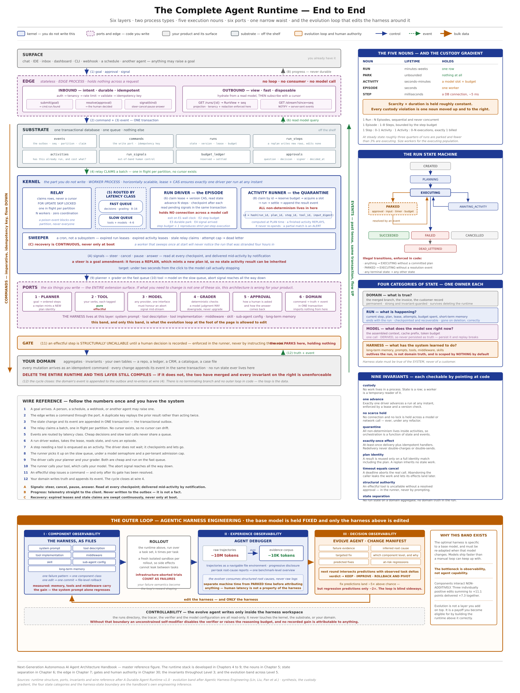

# Agent Harness Runtime

A documentation-first reference for understanding and designing production-grade autonomous agent runtimes and self-evolving agent harnesses.

> **Project status:** architecture and handbook work in progress. This repository currently contains 8 of the planned 50 handbook chapters, a detailed runtime specification, a compiled handbook draft, source diagrams, and the Agentic Harness Engineering research paper. It is a knowledge base, not an executable runtime implementation.



## What this repository covers

- The boundary between the model, its harness, and the execution environment.
- Why long-running autonomous work behaves like a distributed system.
- A six-layer runtime with a narrow contract between generic execution and product-specific domain logic.
- Durable execution vocabulary: Run, Episode, Step, Activity, and Park.
- Separation of domain, run, model, and harness state.
- Client and edge contracts for work that outlives a request or connection.
- Observability-driven evolution of prompts, tools, middleware, skills, sub-agents, and memory.

## Start here

1. Read the [documentation index](docs/README.md) to choose a learning path.
2. Follow the [handbook chapters](docs/handbook/README.md) for the concepts in teaching order.
3. Use the [Universal Runtime v1.0 architecture specification](docs/architecture/universal-runtime-v1.0-architecture-specification.md) as the detailed system reference.
4. Read the [Agentic Harness Engineering paper](docs/research/agentic-harness-engineering-paper.pdf) for the research basis of autonomous harness evolution.

## Repository structure

```text
.
├── README.md
└── docs
    ├── README.md
    ├── architecture
    │   └── universal-runtime-v1.0-architecture-specification.md
    ├── assets
    │   └── diagrams
    ├── handbook
    │   ├── README.md
    │   ├── blueprints
    │   ├── chapters
    │   └── compiled
    └── research
        └── agentic-harness-engineering-paper.pdf
```

## Core architecture in one paragraph

The material treats an autonomous agent as more than an LLM in a loop. A thin edge accepts goals and human signals; a durable substrate stores commands, events, run state, activities, budgets, and approvals; a generic kernel drives leased, checkpointed work; explicit ports isolate model, planning, tools, grading, approval, and domain behavior; and a narrow command/event boundary keeps the product domain independent. The harness surrounding those ports is observable and versioned so it can be evaluated, evolved, and rolled back without changing the base model.

## Source and editorial conventions

The handbook distinguishes claims by provenance:

- `[AHE]` — supported by the Agentic Harness Engineering paper.
- `[DAR]` — supported by the durable/universal runtime architecture specification.
- `[INF]` — engineering inference made by the handbook.
- `[BP]` — industry best practice.
- `[FUT]` — future or speculative proposal.

Keep those markers intact when editing. The Markdown chapters are the editable source; the DOCX file is a compiled reading edition.

## Contributing

- Keep chapter filenames numbered so reading order remains obvious.
- Put handbook planning changes in `docs/handbook/blueprints/`.
- Put reusable architecture figures in `docs/assets/diagrams/` and link them relatively.
- Do not present planned chapters or speculative proposals as implemented behavior.
- Preserve source citations and provenance markers when revising technical claims.
