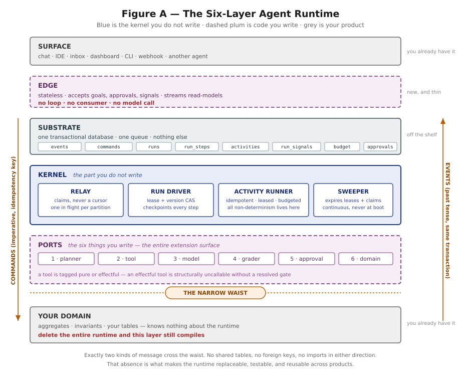
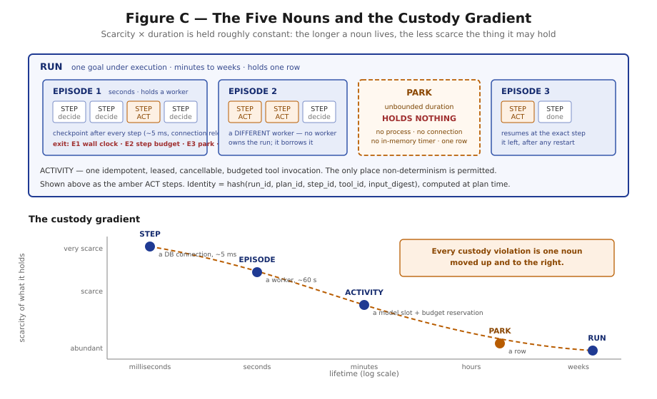

# Architecture Diagrams

These SVGs are the reusable visual summaries for the handbook and architecture material.

## Six-layer agent runtime

Shows the surface, stateless edge, durable substrate, generic kernel, six extension ports, product domain, and the narrow command/event waist between runtime and domain.

## Agentic Harness Engineering loop

Connects component observability, experience observability, and decision observability into an evaluate-evolve-verify loop with file-level attribution and rollback.

## Five nouns and custody gradient

Relates Run, Episode, Step, Activity, and Park to lifetime and the scarcity of the resources each may hold.

## Complete agent runtime

Provides the end-to-end reference: ingress, substrate, worker kernel, ports, human gate, domain boundary, state machine, state ownership, invariants, and execution sequence.
