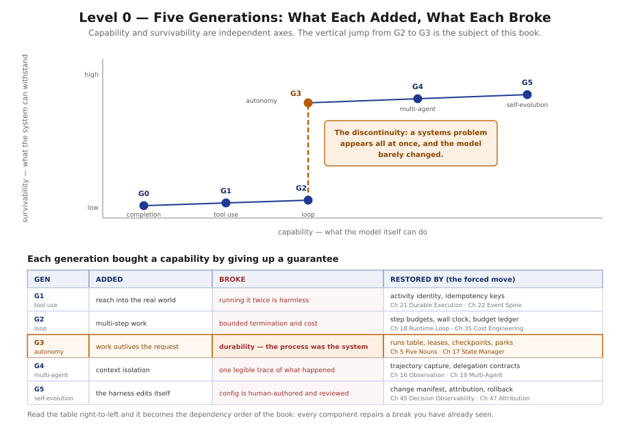

# Level 0 — Foundations

*Chapters 0–3*

---

## What you will be able to do at the end

- Say what an agent is without using the phrase "an LLM in a loop", and explain why that phrase
  fails in production.
- Draw the boundary between the model, the harness, and the environment, and say which side of it
  any given line of code falls on.
- Explain to a sceptical colleague why work that lasts six hours is a distributed-systems problem
  rather than an ML problem, and name the four properties that force it.
- Recognise which of five mental models a design question belongs to, before answering it.
- Read the rest of this handbook in the vocabulary it is written in.

## What you must already hold

Nothing about agents. This level assumes you can write software and have used a language model
through an API at least once. It does **not** assume you have built a distributed system — Chapter
2 introduces every term it needs, and Chapter 2 §2.1 is written specifically for readers who have
not.

If you *have* built distributed systems, Chapter 2 is the important one: it tells you which of your
instincts transfer unchanged, which transfer with a twist, and which will cost you money.

## The questions this level answers

**1. Why is the system shaped like this?**
Because each generation of AI system bought a capability by giving up a guarantee, and every
component you will meet later exists to restore one of those guarantees without handing the
capability back. Chapter 0 makes the history the dependency order.

**2. Which part of it is mine?**
The harness — the only region that is simultaneously yours to write, safe to change, and decisive
for how well the system performs. Chapter 1 draws that boundary precisely and breaks the harness
into seven kinds of part that differ in how hard they are to ignore.

**3. Why is this a distributed system rather than a program?**
Because the moment work outlives the request that asked for it, four properties appear at once that
ordinary request handling cannot provide. Chapter 2 names each one, its standard solution, and the
three places where the standard solution is actively wrong here.

**4. How do I think about it without arguing in circles?**
With five borrowed mental models, each with a stated range and a stated breaking point. Chapter 3
supplies them, along with ARK and Atlas — the runtime and the product that every later chapter is
written about.

## Reading notes

Chapters 0–3 are marked **Foundational Variant**. They use the same sixteen-section template as
every other chapter, but sections 4–9 describe mental models rather than runtime components, because
there is no subsystem to decompose yet. This is deliberate and the template is not broken.

The diagrams in this level are tagged `CONCEPTUAL VIEW` rather than `LAYER`, `TIME`, or `STATE`, for
the same reason.

## Exit condition

> The reader stops thinking of an agent as a prompt in a while loop.

Concretely: you can look at the architecture diagram on the first page of Chapter 4 and, for each
of the six layers, say what would break if it were removed. If that is not yet true, Level 1 will
be a list of components rather than an explanation.

---

**Begin:** [Chapter 0 — Evolution of AI Systems](../chapters/00-evolution-of-ai-systems.md)
