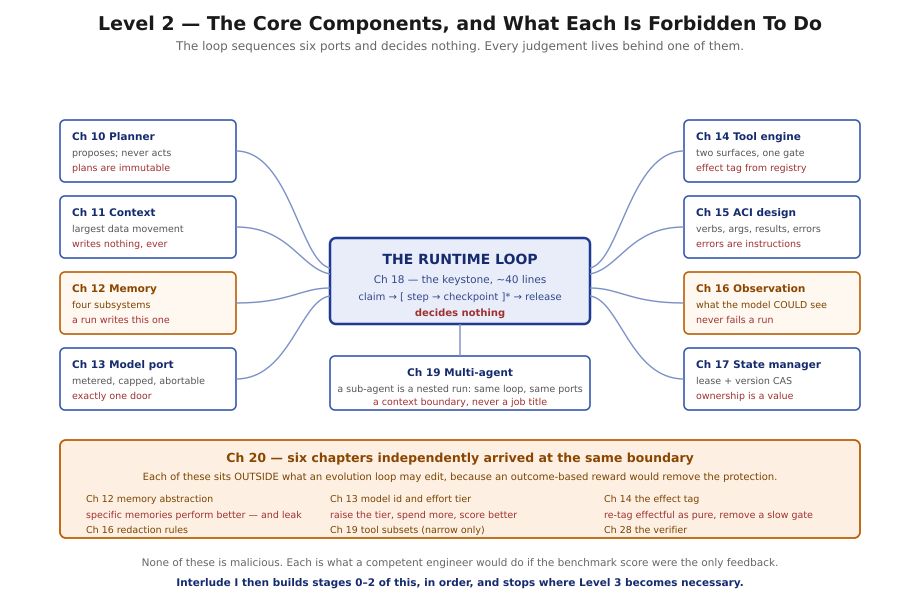

# Level 2 — Core Runtime Components

*Chapters 10–20, then Interlude I*

---

## What you will be able to do at the end

- Implement each of eleven components in isolation, and state its contract to the other ten.
- Explain why a plan is immutable, and why that single decision unifies idempotent replay with human
  authority.
- Treat context as a budgeted, cache-keyed resource rather than a string, and know which of its costs
  is paid on every call forever.
- Design a tool the model can actually use — verbs, arguments, results, and errors — and route a
  model's mistake to the surface that can prevent it.
- Write the runtime loop from memory, name its four exit conditions, and say what each one bounds.
- Decide whether a piece of work wants a tool, a sub-agent, or a task graph, and defend the answer.
- Say what an evolution loop needs from every component, twenty-nine chapters before it is built.

## What you must already hold

All of Level 1, and Chapter 9 in particular. Every chapter here is easiest to read along one of the
three flows, and each names which one at the start. Reading the Context System along control flow, or
the Planner along data flow, produces the sensation that a component is overcomplicated — which is
almost always a sign of reading along the wrong axis.

Chapter 6's four state categories and Chapter 5's five nouns are used continuously and never
re-derived.

## The questions this level answers

**1. What decides what happens next?**
The Planner, and nothing else. Chapter 10 establishes plan identity — a replan mints a new plan
rather than editing the old — and shows that idempotency and human authority are the same problem
wearing different clothes.

**2. What can the model see, and what does that cost?**
Chapters 11 and 12. Context is assembled fresh for every call under a hard budget, ordered by
volatility rather than importance, because position in the request is a cost property. Memory is four
different subsystems, and only one of them is written by a run about itself.

**3. How does the runtime touch anything?**
Chapters 13, 14, and 15: one metered door to the model, one gated door to the world, and — separately
from both — the design of what those doors feel like to the thing using them.

**4. How does the runtime see itself?**
Chapter 16, and it is the chapter Level 5 cannot exist without. Capturing what the model *could see*,
not merely what it did, is the difference between a corpus that explains behaviour and fourteen
terabytes that explain nothing.

**5. What holds it together?**
Chapters 17 and 18. Ownership as a value rather than a lock, and a loop of about forty lines that
sequences six ports and decides nothing.

**6. When is one agent not enough?**
Chapter 19, and the answer is narrower than expected: when a large amount of material must be
examined to produce a small answer requiring judgement. Never because a team would have organised it
that way.

**7. What is all of this for?**
Chapter 20, placed here rather than at Chapter 42 so that the evolution frame is carried through
Levels 3 and 4 rather than met at the end.

## Reading notes

Every chapter in this level is `Full` tier: nine diagrams each, ninety-nine in total. That density is
deliberate — these are the components a reader will actually implement, and the diagrams are the
specification.

**Chapter 18 is the keystone.** It is short, it is mostly a single code listing, and every line of it
is a decision made in an earlier chapter. If a line in it looks arbitrary, the chapter it came from is
worth re-reading; §4 of that chapter names the source for each one.

A pattern emerges across Chapters 12, 13, 14, 16, and 19 that none of them sets out to establish:
each independently concludes that some specific thing must sit *outside* what an evolution loop may
edit. Chapter 20 §5.5 collects them, and the convergence is the strongest argument in the level.

## Exit condition

> The reader can implement each subsystem in isolation and knows its contract to the others.

Concretely: given any of the eleven components, you can state what it is forbidden to do and which
component does that instead. That negative form is the sharper test — Chapter 18 §5.2's table of what
the loop may *not* do is longer than the list of what it does, and the same is true of most
components here.

---

**Begin:** [Chapter 10 — The Planner](../chapters/10-the-planner.md)
