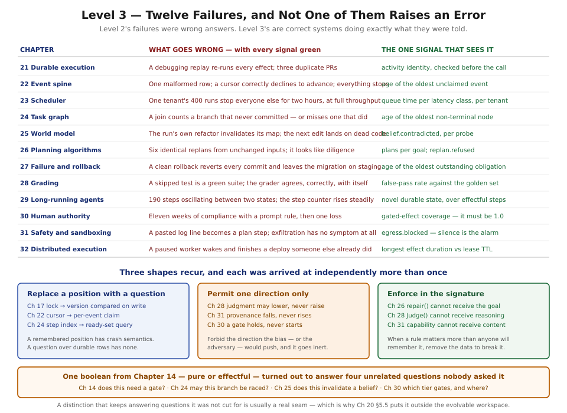

# Level 3 — Advanced Runtime Architecture

*Chapters 21–32*

---

## What you will be able to do at the end

- Make a run survive a crash losing at most one in-flight step, and say precisely which window
  remains open and why it cannot be closed.
- Deliver every event exactly once through a spine that cannot be stalled by one poisoned row.
- Schedule work fairly when one tenant submits four hundred runs, and explain why adding capacity
  never fixes fairness.
- Express work as a graph whose joins are correct across a crash, and say why the graph was forced
  by durability rather than by parallelism.
- Hold beliefs about an environment and know mechanically when the run's own effects invalidated
  them.
- Choose between retrying a step, repairing a plan, and replanning — and refuse a replan that
  carries no new information.
- Recover from partial failure, naming which effects can be rolled back, which need compensation,
  and which are gone.
- Grade work without being fooled by it, using a floor no model judgment may raise.
- Run for six hours and know, at any moment, whether the run is moving.
- Put a human in genuine control, with a gate that costs no capacity and cannot be argued with.
- Bound what a fully compromised step can reach, in four written parts.
- Spread all of it across a fleet while being honest about what a lease does and does not guarantee.

## What you must already hold

All of Level 2, and three chapters in particular do heavy lifting here.

**Chapter 10's immutable, identified plan** is load-bearing in five chapters of this level and is
never re-derived. If "a replan mints a new plan rather than editing the old one" is not yet
automatic, Chapters 24, 26, 27 and 30 will each seem to be making an arbitrary demand.

**Chapter 14's pure/effectful tag** is consumed four separate times in this level and re-argued
nowhere. **Chapter 17's lease and version compare-and-set** are assumed from Chapter 21 onwards and
are finally examined properly in Chapter 32, which is where you find out what they actually promise.

Chapter 18's runtime loop gains three new exits across this level and still makes no decisions. That
is worth watching as it happens.

## The questions this level answers

**1. What survives a crash?**
Chapters 21 and 22. Resume, re-run, and replay are three operations wearing one word, and separating
them is what makes a debugging tool stop opening duplicate pull requests. The outbox is the entire
durability story, and a claim beats a cursor for the same reason a question beats a remembered
position.

**2. Who runs next, and is that fair?**
Chapter 23. One global concurrency integer cannot bound three different resources, and capacity
fixes throughput while never fixing fairness — which is the distinction the chapter is built around.

**3. What shape is the work?**
Chapters 24, 25, and 26. A list conflates dependency with sequence; a graph separates them, and the
derivation reaches a DAG through crash recovery with parallelism appearing only as change left over.
Chapter 25 declares itself the most speculative chapter in the book in its first paragraph and then
makes one claim that is not speculative at all. Chapter 26 supplies what Chapter 10 deliberately left
out: what actually goes inside the planner, and why a replan from unchanged inputs is a retry with
extra steps.

**4. What happens when it goes wrong?**
Chapters 27 and 28. Rollback, compensation, and nothing are three different operations, and a system
with one word for them ships the one that only handles state it owns. Then the harder case: work
that completed, returned successfully, satisfied its contract, and did the wrong thing — where the
answer is a verdict lattice that renders an optimistic judge inert rather than trying to make it
honest.

**5. What if it takes six hours?**
Chapter 29. Progress is novel durable state, not step count, and the difference is a hundred and
ninety steps of oscillation that every dashboard reports as healthy.

**6. Who is actually in charge?**
Chapters 30 and 31. A rule in the prompt is not a control; a gate that costs capacity gets deleted
during a capacity review; and content fetched from the world cannot be prevented from influencing
what a model proposes, so the control moves onto what it can cause.

**7. What breaks when there is more than one machine?**
Chapter 32, which is the reckoning for everything above. Every mechanism in this level was written
as though there were one driver, and this chapter says what that sentence costs.

## Reading notes

**Tiers.** Five chapters are `Full` (21, 22, 23, 30, 32) and seven are `Core` (24–29, 31), for
eighty figures. The Full chapters are the ones whose mechanisms you will implement line by line;
the Core ones are decisions and taxonomies where five diagrams say everything nine would.

**Chapter 25 is the outlier and says so.** It carries almost no weight from either source and opens
by declaring itself the most speculative chapter in the book. Read it for the problem statement and
for §5.2; treat its mechanisms as a sketch.

**Chapter 30 is where five deferred promises come due.** Chapters 14, 27, and 29 each handed it a
different half of the same mechanism, and its §5.4 contains the level's best argument: a human
redirecting a run and a crash recovering one are the same problem, which is why Chapter 10's plan
identity turns out to have been about authority all along.

**One thing recurs that nothing planned.** Every failure in this level produces no error signal.
Not most of them — every one. The poisoned relay stalls silently, the convoy makes everyone wait at
full throughput, the unfired join leaves every dashboard green, the stale belief produces a confident
wrong edit, the replan storm looks like diligence, the clean rollback leaves a migration behind, the
skipped test is a passing suite, the stalled run counts steps, and the duplicate deploy passes every
consistency check. The opening figure is that convergence, with the one signal that catches each.

It has a practical consequence worth carrying into Level 4: **the alerts that matter in this level
mostly fire on the absence of something.** Age of the oldest unclaimed event, age of the oldest
non-terminal node, age of the oldest unresolved obligation, and — in Chapters 31 and 32 — controls
whose silence is itself the alarm. Chapter 34 builds the instrumentation; this level is where you
learn what to point it at.

## Exit condition

> The reader can operate a runtime under partial failure, contention, and adversarial input, and can
> say what each of its safety properties actually guarantees rather than what it is named.

The sharper test is negative and it is the one to apply. For any mechanism in this level, state what
it does **not** protect. A lease does not evict. A compare-and-set does not protect effects. A
sandbox has no opinion about a legitimate credential. A grader's floor cannot be raised, and its
judgment cannot be trusted upward. A gate cannot help after a tier-3 effect has escaped.

Every incident in this level lives in the gap between a mechanism's name and its actual guarantee.

---

**Begin:** [Chapter 21 — Durable Execution](../chapters/21-durable-execution.md)
