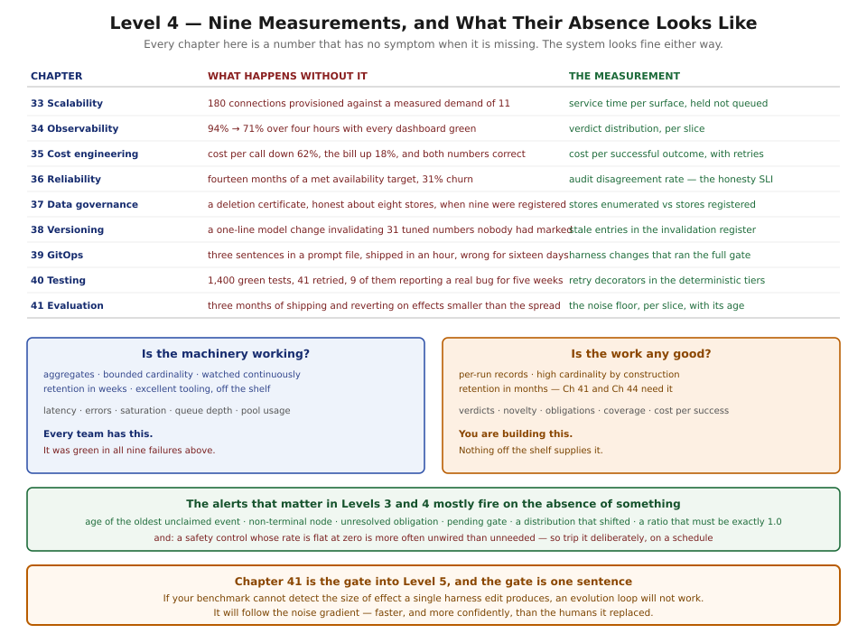

# Level 4 — Production Engineering

*Chapters 33–41, then Interlude II*

---

## What you will be able to do at the end

- Size every capacity surface from a measured service time rather than from a formula, and say which
  one is currently the constraint.
- Answer both operational questions — is the machinery working, and is the work any good — with
  instruments that share almost no signals.
- Report cost against successful outcomes rather than against calls, including the retries that
  failures cause.
- Promise a customer three things you can keep, publish the one you cannot, and know why the
  distinction is not a technicality.
- Enumerate every store holding customer data, delete from all of them, and name the boundary no
  deletion request can cross.
- Version the harness separately from the model and the code, and treat a model change as the
  invalidation event it is.
- Ship a harness change through a pipeline with two gates, and know why review is not the control.
- Test a system whose unit calls a model, without a single retry decorator.
- Measure a benchmark's noise floor, and refuse to make a decision inside it.

## What you must already hold

All of Level 3, and three chapters carry more weight than the rest.

**Chapter 28's verdict lattice** is the foundation of the second half of this level. Chapter 34's
headline signal, Chapter 35's denominator, Chapter 36's honesty objective, and the whole of
Chapter 41 are counts of verdicts, and none of them can be more accurate than the grader producing
them.

**Chapter 27's effect ledger and Chapter 30's decision log** become the two SLIs that are not about
latency. **Chapter 16's capture rule** — record what the model could see — is what makes Chapter 34
possible and what makes Chapter 37 necessary, and those two chapters are in tension for the whole
level.

Chapter 29's timeout-coupling hazard recurs three times here, in Chapters 33, 38, and 41, each time
as a specific measurement rather than a warning.

## The questions this level answers

**1. How much of everything do we need?**
Chapter 33. One formula cannot size four resources whose service times differ by three orders of
magnitude, and the standard one produces an outage by being applied correctly. A run is a load
generator, not a request.

**2. What is actually happening?**
Chapter 34, and the answer is that there are two questions, not one. Infrastructure observability is
a solved problem with excellent tooling and it was green during every failure in this level. The
other one you build yourself.

**3. What does it cost, and is it worth it?**
Chapter 35. The denominator is successful outcomes; a cheaper model that reduces the success rate
raises the price of the thing you are buying. Input dominates output about twenty to one, and most
of it is the trajectory re-sent.

**4. What can we promise?**
Chapter 36. Three things the runtime controls — it terminates, it reports truthfully, its effects
are accounted for — and one thing you publish instead of promising. The honesty promise is the
strictest, because a system that fails and says so is usable and one that fails and reports success
is not.

**5. Whose data is this?**
Chapter 37, which is where Chapter 16's capture rule presents its bill. The trace store is the
highest-risk dataset in the architecture and is misclassified almost everywhere, because it was
built by the observability team and named after telemetry.

**6. How do we change any of it safely?**
Chapters 38, 39, and 40. Three version axes, versioned independently and evaluated jointly; a
pipeline with two gates because the real test is slow and statistical; and a test suite in which
retrying is forbidden, which is achievable only once you notice that most of the system is
deterministic.

**7. How do we know a change helped?**
Chapter 41, and it is the gate into Level 5.

## Reading notes

**Every chapter is Core tier** — five figures each, forty-five in total. These are decisions,
taxonomies, and measurements rather than components to implement, and five diagrams carry them.

**Chapter 41 is the one to read even if you read nothing else here.** It is short, its cold open is
three numbers, and its conclusion determines whether the final level of this book is worth
attempting at your organisation. A team that discovers its benchmark cannot resolve the effects it
is making decisions about has learned the most valuable thing in Level 4, and can act on it this
week.

**The order is a dependency order and it is worth respecting.** Chapter 41 needs Chapter 40's
stability, which needs Chapter 39's pipeline, which needs Chapter 38's versioning, which needs
Chapter 35's cost accounting, which needs Chapter 34's signals, which needs Chapter 33's
measurements. Reading Chapter 41 first is fine; implementing it first is not.

**One thing recurs here that nothing planned, and it is the level's own version of Level 3's
pattern.** Level 3's failures produced no error signal. Level 4's failures produce **no signal at
all** — because in every case the missing thing is a *measurement that was never taken*. A pool
sized by formula looks identical to one sized by measurement until the day it does not. A benchmark
with an unmeasured noise floor produces numbers that look exactly like results. A trace store that
is not in the deletion path returns success from the stores it knows about.

The opening figure is that convergence. Nine chapters, nine measurements, and the second column is
what their absence looks like — which in every case is *nothing*, until it is expensive.

## Exit condition

> The reader can operate an agent system in production, account for its cost, promise something
> about it honestly, change it safely, and tell whether a change made anything better.

The sharper test is Chapter 41's review question, applied to your own system: **for any improvement
you have claimed in the last quarter, what was the noise floor for that measurement?**

If the answer is unavailable, that is the most valuable finding in this level, and it is available
this afternoon at the cost of running an existing benchmark five times on an unchanged harness.

---

**Begin:** [Chapter 33 — Scalability and Capacity Planning](../chapters/33-scalability-and-capacity-planning.md)
