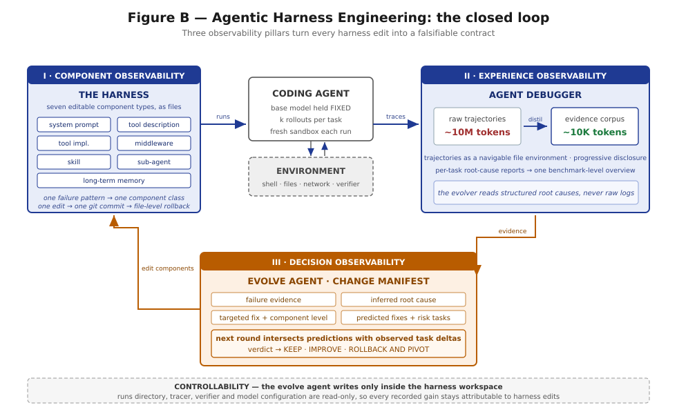

# Level 5 — Self-Evolving Systems

*Chapters 42–49*

---

## What you will be able to do at the end

- Say whether an evolution loop is worth building at your organisation, from measurements rather than
  from enthusiasm, and name the one precondition that is a gate rather than a preference.
- Lay a harness out as seven orthogonal component types at fixed paths, so that a failure pattern
  maps to a component class and an edit has somewhere specific to land.
- Turn ten million tokens of trajectory into ten thousand tokens of evidence a reader can hold, and
  explain why that ratio is the whole point.
- Write an edit as a falsifiable contract — evidence, root cause, targeted fix, predicted fixes,
  at-risk regressions, constraint level — before any result exists.
- Constrain a second agent so that its writes land inside a workspace and nowhere else, and justify
  every item on the containment list from the failure it prevents.
- Run Algorithm 1 in the right order, intersect predictions against observed deltas, and assign keep,
  improve, or rollback-and-pivot per edit.
- State what the loop is measurably bad at, and design around a process that predicts what it will
  fix roughly five times better than it predicts what it will break.
- Operate the loop as production infrastructure, with human gates on the loop itself.

## What you must already hold

All of Levels 1 through 4, and four chapters carry most of the weight.

**Chapter 20** is the map of this level and was placed at the end of Level 2 for that reason. It
introduced the three pillars, Algorithm 1 and its phase ordering, the change manifest, and the
containment boundary. Level 5 builds each of those properly; it does not re-introduce them.

**Chapter 41 is the gate.** An evolution loop makes thousands of small statistical judgments with
nobody reading any individual number. Below the noise floor it does not fail loudly — it produces
motion, a rising score on its own instrument, and an accumulation of edits that is a random walk
with a positive selection bias. If your benchmark cannot resolve the effect one edit produces, this
level is not yet for you, and Chapter 42 §5.6 says so in a checkable form.

**Chapter 39's harness workspace** is the action space. Components as files, one commit per edit,
revert as a first-class operation. **Chapter 40's hermetic replay** is what makes an automatic
rollback trustworthy rather than hopeful.

Eight earlier chapters also contribute something they did not set out to: each one independently
concluded that some specific thing must sit outside what an evolution loop may edit. Chapter 46
collects that list, and Chapter 48 admits it is not known to be complete.

## The questions this level answers

**1. Why should a machine be doing this at all?**
Chapter 42. Because harness fit is a rate rather than a stock: it is worth a great deal at any
instant, it decays whenever the model underneath changes, and the schedule is set by the provider.
Eighteen months and a hundred and forty-three edits netted 1.3 points against a 3.1-point floor —
not because the work was bad, but because most of it was re-earning ground the last release took
away.

**2. What can be changed, and where does a failure belong?**
Chapter 43. Seven component types as files at fixed mount points, loosely coupled, with a
deliberately minimal seed — because a seed that is already fitted destroys attribution.

**3. What actually happened, and why?**
Chapter 44, and this is the level's largest engineering problem. Ten million trace tokens per batch
against a reader that can hold ten thousand. Trajectories as a navigable file environment, per-task
analyses, a benchmark-level overview, progressive disclosure as a token strategy.

**4. What did we expect this edit to do?**
Chapter 45. Every edit as a falsifiable contract, recorded before the result exists. Without this
the loop generates plausible edits and can never tell whether any of them worked.

**5. What is the loop forbidden to touch?**
Chapter 46. Controllability constraints, the constraint-level hierarchy, and the anti-pattern of
repeatedly fixing at the wrong level — three rounds of instruction rewording for something five
lines of middleware would settle.

**6. Did it help, and if not, what happens?**
Chapter 47. Algorithm 1's phase ordering and why attribution runs *before* distillation; predicted
sets intersected with observed deltas; keep, improve, or rollback-and-pivot.

**7. What does it not do?**
Chapter 48, which is the chapter that keeps the book honest. Effective edits do not stack:
three positive single-component gains summing to +11.1 points yield +7.3 together. Fix prediction
runs at roughly five times random and regression prediction at roughly two — the loop cannot see
what it is about to break.

**8. How is it governed?**
Chapter 49. Human review gates on the evolution loop itself, misuse prevention, harness cleanup,
and the honest framing of the source as a controlled prototype.

## Reading notes

**Section 14 changes here.** In Levels 0 through 4 it was *Relation to AHE*, because the paper was a
source being cited. In Level 5 the loop is the subject, so the section becomes *Relation to the Base
Runtime* and asks the inverse question: what does the runtime supply, and what does the loop owe it.

**Four chapters are Full tier and four are Core**, and the split follows the bottleneck rather than
the narrative. Chapters 43 through 46 — the instruments and the agent that uses them — carry nine
figures each. Chapters 42, 47, 48, and 49 carry five.

**The order is deliberately not the loop's execution order.** The loop runs benchmark, attribute,
distil, edit, commit; the chapters run case, components, experience, decisions, agent, attribution.
Chapter 42 §4 explains why: the bottleneck in a harness re-fit is reading, not deciding, so the
instruments come before the actor that uses them.

**Chapter 48 comes before Chapter 49 on purpose.** Governance framed as a response to a measured
blindness is a different argument from governance framed as general precaution, and only the first
one survives contact with a team that wants to ship.

**This level is the least finished part of the book, and says so repeatedly.** One benchmark family,
a bounded iteration count, non-additive gains, weak regression prediction. The loop is real,
measured, and useful; it is not a solved problem, and a chapter that pretended otherwise would be
the only dishonest chapter in the handbook.

## Exit condition

> The reader can decide whether to build an evolution loop, build one whose every edit is
> attributable, constrain what it may touch, roll back what it breaks, and state its limits without
> being asked.

The sharper test is Chapter 42's review question, applied to your own system: **for any harness
improvement you claimed in the last year, is it still worth anything on the model deployed today?**

One paired benchmark run against a version already in your repository answers it. If the answer is
yes, the fitting compounds and this level is optional. If the answer is no, the fitting is
maintenance — and maintenance on someone else's schedule is exactly the thing worth automating.

---

**Begin:** [Chapter 42 — The Case for Harness Evolution](../chapters/42-the-case-for-harness-evolution.md)
